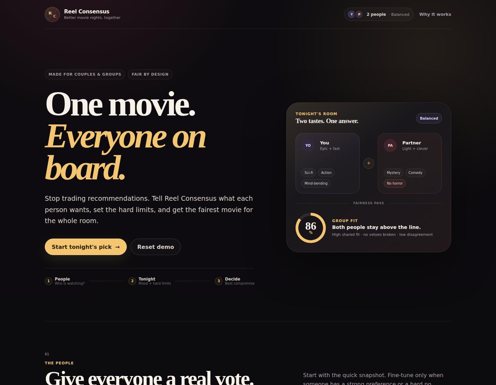

# Reel Consensus

**Stop scrolling. Agree on something worth watching.**

[](https://github.com/MykolaDotsenko/reel-consensus/actions/workflows/ci.yml)
[](https://vercel.com/new/clone?repository-url=https://github.com/MykolaDotsenko/reel-consensus)

Reel Consensus is a group movie decision engine. Instead of recommending what one person might like, it tries to find the fairest compromise for everyone in the room — with visible participant scores, hard vetoes, configurable fairness, and explanations for every result.

## Product preview



## Brand identity


**Less debate. More movie nights.**

The visual identity combines two overlapping film reels / people with a shared check-mark center: different tastes moving toward one fair decision. Production SVG assets live in `public/brand/`, while generated source references are preserved in the repository for future visual work.

- [Brand system and usage rules](docs/branding/BRAND.md)
- [Generated logo master](public/brand/reel-consensus-logo-master.webp)
- [Brand identity board](docs/branding/reel-consensus-brand-board.webp)
- [Landing-page direction reference](docs/branding/reel-consensus-landing-direction.webp)

## Product thesis

Movie night is rarely an information problem. People already have too many options. The hard part is reaching a decision when tastes, moods, time limits, and hard dislikes conflict.

Reel Consensus models that problem explicitly:

```text
people + preferences + vetoes + shared brief
                    ↓
            hard constraints
                    ↓
        per-person fit scoring
                    ↓
           fairness strategy
                    ↓
        ranked group compromises
                    ↓
       reasons + visible trade-offs
```

## Current MVP

- 1–5 participants with independent genre preferences, moods, and hard vetoes.
- Shared natural-language movie-night brief.
- Optional OpenRouter AI intent parsing.
- Deterministic local parser when AI is unavailable.
- Hard runtime, rating, and group-wide genre constraints.
- Three fairness modes:
  - **Balanced** — rewards fit while penalizing disagreement.
  - **No one hates it** — strongly protects the least-satisfied participant.
  - **Democratic** — prioritizes the group average.
- Explainable top recommendations with:
  - group-fit score;
  - per-person fit scores;
  - reasons;
  - visible trade-offs.
- “Not tonight” reranking.
- “Surprise us” from the current high-fit pool.
- Optional real TMDB movie catalogue.
- Country-aware streaming availability with provider filtering.
- JustWatch-attributed watch-provider data before group scoring.
- Responsive desktop/mobile UI.
- Unit, interaction, and Playwright coverage.

## Why AI is not the decision engine

AI has one narrow job: translate fuzzy human language into structured signals such as:

```json
{
  "likedGenres": ["mystery", "comedy"],
  "avoidedGenres": ["horror"],
  "moods": ["funny", "thoughtful"],
  "maxRuntime": 120,
  "minRating": 7.5
}
```

The actual ranking is deterministic and testable. If the AI provider is down or no API key is configured, Reel Consensus falls back to a local parser and the product still works.

## Architecture

```text
src/
├── components/          product UI
├── data/                curated demo movie catalogue
├── domain/
│   ├── decisionEngine   participant scoring + fairness + explanations
│   ├── intentParser     deterministic natural-language fallback
│   └── types            domain contracts
├── lib/                 AI intent client boundary
└── App.tsx              session composition + product flow

api/
├── interpret.ts         optional OpenRouter serverless intent parser
├── providers.ts         TMDB regions + streaming-provider directory
└── catalog.ts           filtered real-movie candidate pool

e2e/
└── smoke.spec.ts        critical browser flows
```

## Stack

- React 19
- TypeScript
- Vite
- Vercel Functions
- OpenRouter-compatible AI endpoint
- Vitest + Testing Library
- Playwright
- ESLint
- GitHub Actions

## Local development

Requires Node.js 22.13+.

```bash
npm ci
npm run dev
```

The product works without AI configuration.

## Optional shared-room configuration

The single-device demo works without a backend. Live multi-device rooms activate when a Supabase project is configured.

1. Apply the migrations in order:
   - `supabase/migrations/0001_shareable_rooms.sql`
   - `supabase/migrations/0002_playback_context.sql`
   - `supabase/migrations/0003_room_security_hardening.sql`
2. Enable Anonymous Sign-Ins in Supabase Auth.
3. Add the public project values:

```bash
VITE_SUPABASE_URL=https://<project-ref>.supabase.co
VITE_SUPABASE_ANON_KEY=<publishable-or-anon-key>
```

The browser never receives a service-role key. Invite tokens are exchanged for room membership by database RPC, room reads/writes are protected by RLS plus explicit Data API grants, and the invite token is removed from the guest URL immediately after a successful join. In shared rooms, the host controls shared rules/playback context; each member can only update their own preference/ready columns.

## Optional real catalogue configuration

The bundled demo catalogue remains a safe fallback. To activate real movie discovery and country/provider availability, add a **server-side** TMDB API Read Access Token:

```bash
TMDB_ACCESS_TOKEN=...
```

Do not expose this token with a `VITE_` prefix.

When configured, Reel Consensus:

1. loads supported watch-provider regions and services;
2. applies country, provider, monetization, runtime and rating filters during TMDB discovery;
3. removes participant/group veto genres before enrichment;
4. enriches a bounded candidate pool with runtime, keywords and watch-provider data;
5. rejects movies with no matching availability before the deterministic group decision engine runs.

Streaming-provider data is supplied by TMDB through its JustWatch partnership and is attributed in the UI. The app links to the TMDB-provided availability destination rather than inventing provider deep links.

## Optional AI configuration

Copy the environment template:

```bash
cp .env.example .env.local
```

Set only your API key:

```bash
OPENROUTER_API_KEY=...
```

By default, Reel Consensus uses:

```text
google/gemma-4-31b-it:free
```

`OPENROUTER_MODEL` remains an optional override, so you can switch models without changing application code:

```bash
OPENROUTER_MODEL=another/provider-model
```

The default model is intentionally isolated behind this configuration boundary because free-model availability can change over time.

For local testing of the Vercel API route, use `vercel dev` or deploy the project to Vercel. Plain `vite` development will automatically fall back to the local intent parser because `/api/interpret` is unavailable.

## Production activation

Production code is complete, but live TMDB/Supabase capabilities require external resources and credentials that are intentionally not committed.

See [docs/PRODUCTION_ACTIVATION.md](docs/PRODUCTION_ACTIVATION.md) for the release runbook.

After deployment:

```bash
npm run verify:production -- \
  --url https://<deployment>.vercel.app \
  --require-live-catalog true \
  --require-shared-rooms true
```

The verifier checks the root app, `/api/health`, Finland provider discovery, a Finland live-catalogue query, availability invariants, and the presence of the Supabase client configuration.

## Quality commands

```bash
npm run lint
npm test
npm run build
npm run test:e2e
npm run check
```

## Reliability rules

- Participant vetoes are hard constraints, not weak negative weights.
- Group-wide hard constraints run before preference scoring.
- AI never selects the final movie.
- Model output is validated against allowed genres, moods, runtime, and rating ranges.
- An unavailable or malformed AI response falls back safely.
- The UI exposes trade-offs rather than pretending every recommendation is perfect.

## Data scope

The product now has two catalogue modes:

- **Live** — TMDB discovery + country/provider availability, normalized behind Reel Consensus domain contracts.
- **Demo fallback** — the original bundled catalogue, used when TMDB is intentionally unconfigured or temporarily unavailable.

TMDB-specific IDs, genre IDs and response shapes never enter the decision engine. Availability is a hard pre-ranking constraint when live mode is active.

## Product roadmap

The production plan is documented in depth:

- [Product Success Blueprint](docs/PRODUCT_STRATEGY.md) — product loop, five strategic capabilities, retention, distribution, failure modes and success metrics.
- [Production Architecture](docs/PRODUCTION_ARCHITECTURE.md) — catalogue/provider boundaries, anonymous rooms, Supabase data model, taste learning and fairness memory.
- [Implementation Roadmap](docs/ROADMAP.md) — phased delivery order, release gates and product exit metrics.
- [External Constraints & Research](docs/RESEARCH.md) — current TMDB, JustWatch, Watchmode and Supabase constraints that affect architecture.

High-level sequence:

1. anonymous shareable rooms + measurement;
2. real movie catalogue + country/provider availability;
3. saved groups + persistent history;
4. evidence-based taste learning;
5. capped explainable long-term fairness memory;
6. distribution and retention optimization.

## Positioning

This is intentionally not another movie search or favorites app. The core product is **multi-person decision support**: make disagreement measurable, preserve vetoes, and optimize for a compromise people can actually accept.


## Data attribution

This product uses the TMDB API but is not endorsed or certified by TMDB.

Streaming availability data is powered by JustWatch through TMDB. Availability may change; Reel Consensus treats provider data as a current best-effort signal rather than a guarantee.
