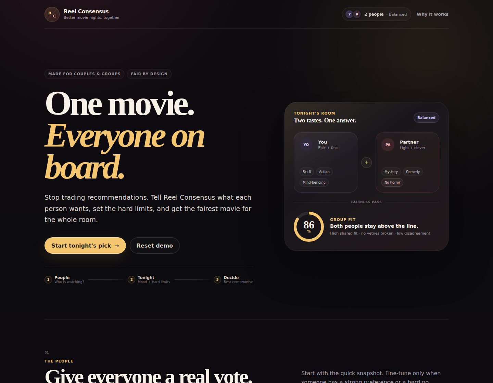

# Reel Consensus

**Stop scrolling. Agree on something worth watching.**

[](https://github.com/MykolaDotsenko/reel-consensus/actions/workflows/ci.yml)

Reel Consensus is a **group movie decision engine**. It does not try to predict what one person will like; it looks for a compromise the whole group can accept while keeping vetoes and individual trade-offs visible.



**GitHub Pages demo:** https://mykoladotsenko.github.io/reel-consensus/

GitHub Pages hosts the static, credential-free decision flow. Server-side TMDB/OpenRouter endpoints and optional shared-room infrastructure remain deployment-specific integrations.

## The decision problem

Movie night is rarely short on options. The hard part is disagreement.

```text
people + preferences + vetoes + shared brief
                    ↓
            hard constraints
                    ↓
        per-person fit scoring
                    ↓
           fairness strategy
                    ↓
        ranked group compromises
                    ↓
       reasons + visible trade-offs
```

Hard vetoes run before ranking. They are not weak negative weights that a high average can wash away.

## Fairness modes

The same participant inputs can be evaluated in different ways:

- **Balanced** — rewards fit while penalizing disagreement;
- **No one hates it** — strongly protects the least-satisfied participant;
- **Democratic** — prioritizes the group average.

Every recommendation exposes the group score, per-person fit and reasons/trade-offs.

The point is not to pretend there is one objectively correct film. It is to make the compromise inspectable.

## Current capabilities

- 1–5 participants with independent genres, moods and vetoes;
- shared natural-language movie-night brief;
- runtime/rating/group genre constraints;
- deterministic group ranking;
- “Not tonight” reranking;
- “Surprise us” from the current high-fit pool;
- optional TMDB catalogue and country/provider availability;
- optional single-session/shared-room mode;
- responsive desktop/mobile UI;
- unit, interaction and browser coverage.

## AI has one narrow job

An optional AI endpoint can translate a fuzzy request such as:

> funny mystery, under two hours, no horror

into structured signals such as genres, moods, runtime and rating limits.

The **decision engine remains deterministic**. Model output is validated before use, and a local parser takes over when the provider is unavailable or unconfigured.

AI never chooses the final movie.

## Architecture

```text
React UI
   ↓
session / participant state
   ↓
hard constraints
   ↓
deterministic decision engine
   ↓
fairness + explanations

optional boundaries:
natural language → /api/interpret → validated intent
catalogue        → /api/catalog   → normalized movies
shared rooms     → Supabase       → room/member state
```

TMDB/provider response shapes do not enter the decision engine directly. External data is normalized behind application-owned contracts.

## Stack

- React 19
- TypeScript
- Vite
- Vercel Functions
- optional Supabase shared rooms
- optional TMDB catalogue
- optional OpenRouter-compatible intent parsing
- Vitest + Testing Library
- Playwright
- ESLint
- GitHub Actions

## Reliability rules

- participant vetoes are hard constraints;
- group-wide hard constraints run before preference scoring;
- AI does not rank movies;
- external/model output is validated;
- malformed/unavailable AI falls back to the local parser;
- the UI shows trade-offs instead of presenting every recommendation as perfect;
- demo catalogue remains available when the live catalogue is unavailable.

## Local development

Requires Node.js 22.13+.

```bash
npm ci
npm run dev
```

The core single-device product works without external credentials.

Optional integrations are documented in:

- [Production activation](docs/PRODUCTION_ACTIVATION.md)
- [Production architecture](docs/PRODUCTION_ARCHITECTURE.md)
- [Research / external constraints](docs/RESEARCH.md)

## Quality

```bash
npm run lint
npm test
npm run build
npm run test:e2e
npm run check
```

## Positioning

This is intentionally not another movie search/watchlist application.

The core problem is **multi-person decision support**: preserve hard dislikes, compare group-fit strategies, and explain a compromise people can actually discuss.

## Data attribution

This product uses the TMDB API but is not endorsed or certified by TMDB.

Streaming availability is supplied through TMDB/JustWatch data and is treated as a best-effort signal rather than a guarantee.
